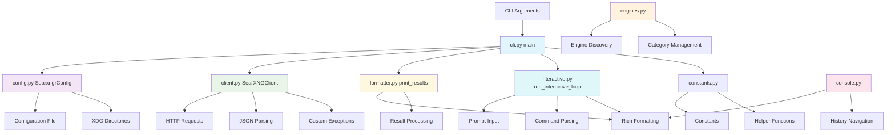
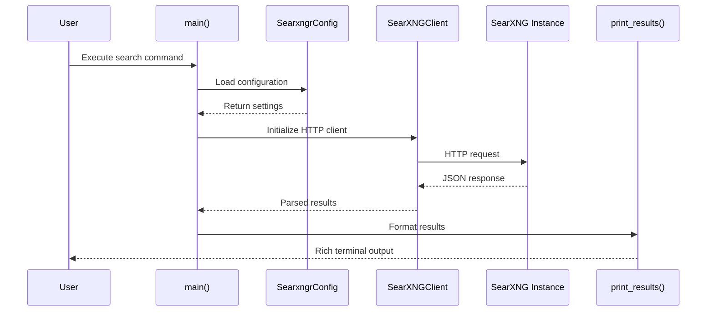
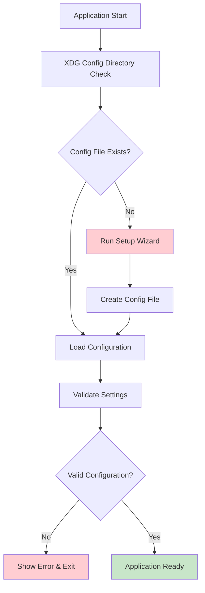
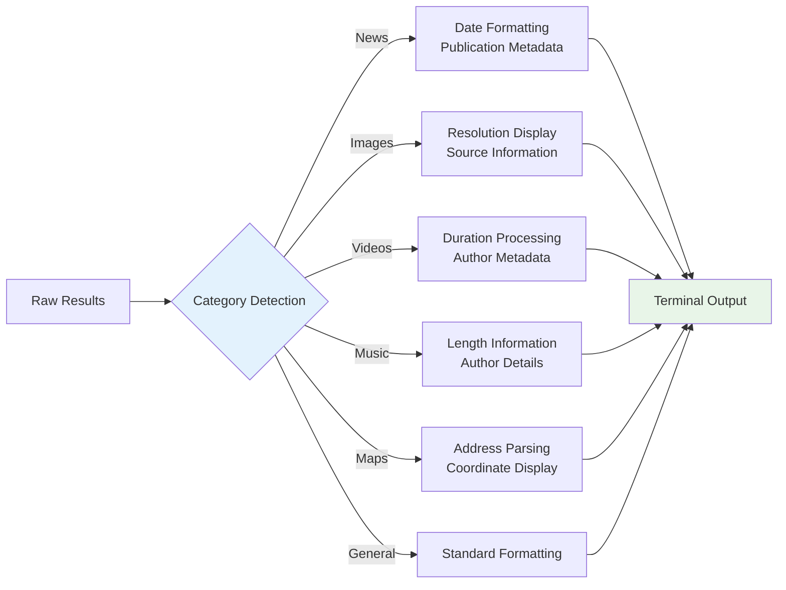
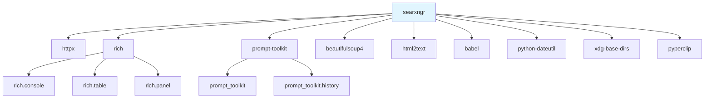
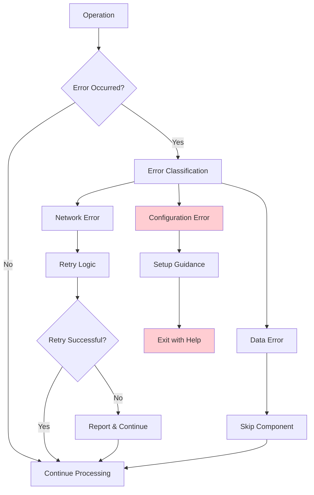
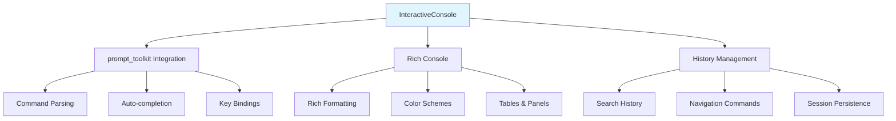

# Architecture Documentation

This document describes the architecture of **searxngr**, a command-line
interface tool for performing web searches using SearXNG instances.

## Table of Contents

1. [Overview](#overview)
1. [Core Components](#core-components)
1. [Component Relationships](#component-relationships)
1. [Data Flow](#data-flow)
1. [Configuration Architecture](#configuration-architecture)
1. [Search Categories](#search-categories)
1. [External Dependencies](#external-dependencies)
1. [Error Handling](#error-handling)
1. [Interactive Features](#interactive-features)

## Overview

**searxngr** is a Python-based CLI application that provides a rich terminal
interface for searching the web through SearXNG instances. The application
follows a layered architecture pattern with clear separation between
presentation, business logic, and data access layers.

### Key Architectural Principles

- **Configuration-Driven Design**: All aspects configurable through INI files
  and command-line arguments
- **Modular Component Architecture**: Each component has a single responsibility
- **XDG Compliance**: Follows XDG Base Directory specification for configuration
  management
- **Graceful Degradation**: Handles missing data and network failures gracefully

## Core Components

### 1. CLI Entry Point (`searxngr/cli.py`)

The central orchestrator that coordinates all application functionality:

- **`main()`**: Primary entry point handling argument parsing and execution flow

### 2. HTTP Client (`searxngr/client.py`)

Abstracts all communication with SearXNG instances:

- Supports both GET and POST HTTP methods
- Configurable timeouts and SSL verification
- Custom User-Agent headers
- JSON response parsing with error handling
- Basic authentication support
- Custom exception hierarchy for testable error handling:
  - `SearXNGError` - base exception
  - `SearXNGConnectionError` - connection failures
  - `SearXNGTimeoutError` - timeout errors
  - `SearXNGHTTPError` - HTTP error responses
  - `SearXNGJSONError` - JSON decode errors

### 3. Configuration Management (`searxngr/config.py`)

Handles all configuration aspects:

- XDG-compliant configuration file management
- First-time setup wizard
- Environment variable integration
- Default value management
- Configuration validation

### 4. Engine Management (`engines.py`)

Dynamically discovers and manages search engines:

- Parses SearXNG preferences HTML
- Extracts engine capabilities and metadata
- Manages engine categories and reliability scores
- Handles bang commands and engine switching

### 5. Console Interface (`searxngr/console.py`)

Provides enhanced terminal interaction:

- Rich console formatting
- Command history navigation
- Password input support
- Interactive engine management

### 6. Result Formatter (`searxngr/formatter.py`)

Handles search result display:

- `print_results()`: Formats and displays search results
- Category-specific output (news, images, videos, music, maps, files, science)
- URL parsing using `urllib.parse`
- Content truncation and HTML-to-text conversion
- Terminal width-aware formatting

### 7. Interactive Commands (`searxngr/interactive.py`)

Manages interactive console session:

- `run_interactive_loop()`: Handles interactive command processing
- Navigation commands (n, p, f for next/previous/first page)
- Result opening (index to open, c to copy URL, o for secondary handler)
- Dynamic configuration (e for engines, t for time range, F for safe search)
- Debug toggle and settings display

### 8. Constants and Helpers (`searxngr/constants.py`)

Global constants and utility functions:

- Default settings and configuration values
- Helper functions: `parse_engine_command()`, `validate_engines()`,
  `validate_url_handler()`
- URL handlers for different platforms
- Time range and category definitions

## Component Relationships



## Data Flow

### Search Execution Flow



### Configuration Loading Sequence



## Configuration Architecture

### Configuration File Structure

```ini
[searxngr]
searxng_url = https://searxng.example.com
result_count = 10
safe_search = moderate
engines = duckduckgo google brave
categories = general news
expand = false
language = en
http_method = GET
timeout = 30
basic_auth_username = 
basic_auth_password = 
verify_ssl = true
```

### Configuration Precedence

1. **Command-line arguments** (highest priority)
1. **Configuration file**
1. **Default values** (lowest priority)

### XDG Directory Compliance

- **Primary**: `$XDG_CONFIG_HOME/searxng/config.ini`
- **Fallback**: `~/.config/searxng/config.ini`
- **Development**: Local `config.ini` for testing

## Search Categories

The architecture provides specialized handling for different result types:

### Category-Specific Processing



### Content Processing Pipeline

1. **HTML to Text Conversion**: Uses `html2text` for content previews
1. **Content Truncation**: Limits to `MAX_CONTENT_WORDS` (128 words)
1. **Date Parsing**: `dateutil.parser` with `babel` localization
1. **Terminal Formatting**: Dynamic width adjustment using
   `os.get_terminal_size()`

## External Dependencies

### Core Runtime Dependencies

- **`httpx`**: Async HTTP client for SearXNG communication
- **`rich`**: Terminal formatting and rich text display
- **`prompt-toolkit`**: Interactive console features and command history
- **`beautifulsoup4`**: HTML parsing for engine extraction
- **`html2text`**: HTML to markdown conversion for content previews
- **`babel`**: Date localization and formatting
- **`python-dateutil`**: Robust date parsing
- **`xdg-base-dirs`**: Cross-platform configuration directory management
- **`pyperclip`**: Clipboard integration for URLs

### Development Dependencies

- **`pytest`**: Testing framework with extensive mocking support
- **`black`**: Code formatting (120 character line limit)
- **`flake8`**: Linting and style checking
- **`hatchling`**: Build backend for package distribution
- **`uv`**: Package manager and tool installer

### Dependency Relationships



## Error Handling

### Custom Exception Hierarchy

The client uses a custom exception hierarchy for testable error handling:

- **`SearXNGError`**: Base exception for all SearXNG-related errors
- **`SearXNGConnectionError`**: Raised when connection to SearXNG instance fails
- **`SearXNGTimeoutError`**: Raised when request times out
- **`SearXNGHTTPError`**: Raised for HTTP error responses (4xx, 5xx)
- **`SearXNGJSONError`**: Raised when JSON response cannot be decoded

Exceptions are caught in `cli.py` and displayed to the user with appropriate
error messages.

### HTTP Error Management

- **JSON Decode Errors**: Graceful handling via `SearXNGJSONError`
- **Connection Failures**: Timeout and network error handling via
  `SearXNGConnectionError`
- **SSL Issues**: Configurable certificate verification
- **Engine Failures**: Reporting of unresponsive search engines

### User Experience Error Handling

- **Configuration Errors**: Clear error messages with setup guidance
- **First-time Setup**: Interactive wizard for initial configuration
- **Debug Mode**: Verbose error output for troubleshooting
- **Graceful Degradation**: Continued operation with missing data

### Error Recovery Flow



## Interactive Features

### Console Engine Management

The application supports dynamic engine management during interactive sessions:

- **Engine Switching**: Add/remove engines with `e +engine` or `e -engine`
- **Category Management**: Switch between search categories
- **History Navigation**: Arrow key navigation through search history
- **URL Handlers**: Configurable primary and secondary URL handlers

### Interactive Console Architecture



### Browser Integration

- **Primary URL Handler**: System default browser
- **Secondary URL Handler**: Alternative browser or tools
- **Platform-specific Defaults**: Different defaults per operating system
- **Custom Commands**: Support for custom URL opening commands

______________________________________________________________________

## Architecture Summary

The searxngr architecture demonstrates a well-structured CLI application with:

- **Clear separation of concerns** across presentation, business logic, and data
  layers
- **Robust configuration management** following XDG standards
- **Extensible search engine management** with dynamic discovery
- **Rich terminal interface** with interactive features
- **Comprehensive error handling** for reliable operation
- **Modular design** enabling easy testing and maintenance

This architecture provides a solid foundation for both current functionality and
future enhancements while maintaining simplicity for end users.
